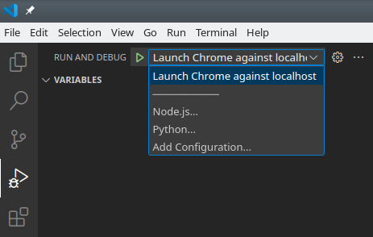
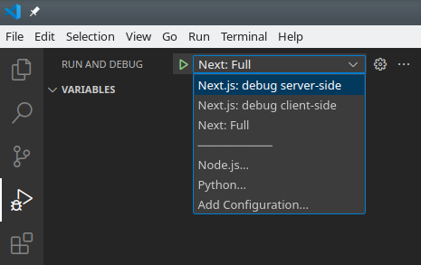

# JavaScript vsCode Debugging

This repository goes together with the weKnow's NSL presentation done in 2023 by Matías Vessuri: [Using Xdebug for Drupal - Part 2](https://drive.google.com/file/d/1vkVSxUoA29TbzvAbZn7N2k9OYdRNrLdO/view?usp=share_link).

To replicate the presentation locally first clone this repository.

## Debugging a self contained page

This demo uses the example from [Chrome DevTools](https://developer.chrome.com/docs/devtools/) which is a local HTML with a JS attached to it.

To run it you need to use a [local configuration](https://code.visualstudio.com/docs/nodejs/browser-debugging#_launching-browsers):

```
{
  "version": "0.2.0",
  "configurations": [
    {
      "type": "chrome",
      "request": "launch",
      "name": "Launch Chrome against localhost",
      "file": "${workspaceFolder}/index.html",
    }
  ]
}
```

This should be the content of your [simple/launch.json](./simple/.vscode/launch.json) which is also included in this repository.

First we open vsCode:

```
cd simple/
code .
```

To launch it you'll need to use the debug button:




Chrome opens and you'll be able to debug as with any debugger. Just use the HTML application, add breakpoints, etc...

## Debugging Javascript within Drupal

The idea here is to debug JS functions within the Drupal running environment.

Even though it should be possible to run both debugger simultaneusly (xDebug + JSdebug), in this case we only debug JS.

The environment is using a docksal, just follow the [drupal/README.md](./drupal/README.md) instructions in this repository to run.

## Debugging frontend (NextJS) and backend (NodeJS) simultaneusly

This is a NextJS application which has two parts (frontend+backend), so we'll first need to build the local environment.
Additionally it uses a Drupal backend as well, which needs to be available/running for the full solution to run (currently using a Pantheon Drupal as the source of the backend information).

First make sure you are running Node 18 and then you can run:

```
cd nextjs/
yarn
```

Once all packages have been dowload it you can test it by running:

```
yarn dev
```

The idea is to run all within vsCode and for that you use the "compounds" configuration from the [nextjs/launch.json](./nextjs/.vscode/launch.json).

This creates 3 debug configurations which you can run:



1. "Next.js: debug server-side" this will run only the NodeJS backend only.
2. "Next.js: debug client-side" This will run the NextJS frontend only (and you need to have the backend running).
3. "Next: Full" this will run both backend and frontend simultaneusly and both can be dubugged.
